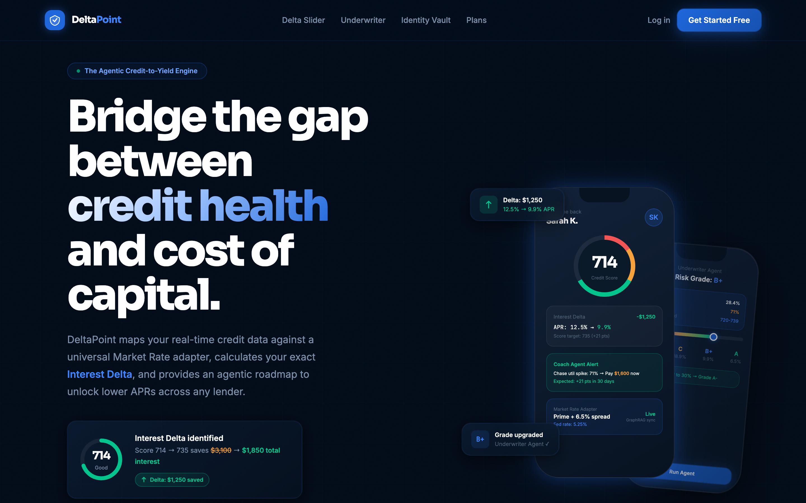

# DeltaPoint
https://delta-point-underwriter.vercel.app/

**The Agentic Credit-to-Yield Engine**

DeltaPoint is a financial co-pilot that answers one question:

> *"What is the exact dollar cost of your current credit score — and what is the fastest path to a lower rate?"*

Instead of showing you a number and walking away, DeltaPoint calculates your **Interest Delta** — the precise dollar difference between what you pay today and what you could pay with a better credit profile — and gives you an agentic roadmap to close that gap.



---

## What It Does

| Module | Plain English |
|---|---|
| **Delta Slider** | Move a credit score slider and watch your monthly payment and total interest update live. See exactly how much each score point is worth in dollars. |
| **Underwriter Agent** | Enter your credit inputs (score, DTI, utilization). A deterministic AI agent calculates your risk grade, the interest rate you qualify for, and the single action that upgrades your tier. |
| **Coach Agent** | An AI monitor that fires proactive alerts — "your utilization just hit 71%, pay $1,600 now to save $1,250 in interest." No waiting. No logging in to check. |
| **Identity Vault** | Upload a W2, pay stub, or tax return. AI vision parses it in under 60 seconds and verifies your income — replacing a 3–7 day manual process. |

---

## Quick Start

```bash
git clone https://github.com/bnamatherdhala7/DeltaPoint-Underwriter.git
cd DeltaPoint-Underwriter
npm install
node serve.mjs
```

Open **http://localhost:3000** in your browser.

---

## Documentation

| Doc | What's inside |
|---|---|
| [Features](docs/FEATURES.md) | All 5 features explained with screenshots — what each does and why it matters |
| [Architecture](docs/ARCHITECTURE.md) | System diagrams, data flow, agent graph, the Delta formula |
| [Getting Started](docs/GETTING-STARTED.md) | Full setup guide, dev server, screenshot utility, project structure |
| [PRD & Market Research](docs/PRD.md) | Product requirements, market data, competitive analysis, success metrics |
| [Architectural Decisions](docs/DECISIONS.md) | Why LangGraph, why deterministic Underwriter, why Gemini Flash — the reasoning behind every key choice |

---

## Tech Stack

```
Orchestration  →  LangGraph (stateful multi-agent workflows)
Intelligence   →  Gemini 1.5 Pro + LlamaIndex GraphRAG
Vision / OCR   →  Gemini 1.5 Flash (document parsing)
Protocol       →  Model Context Protocol (MCP)
UI             →  React 19 · Tailwind CSS · Framer Motion
Dev Env        →  Claude Code
```

---

## Project Structure

```
DeltaPoint-Underwriter/
├── index.html          ← Full single-page application
├── serve.mjs           ← Local dev server (port 3000)
├── screenshot.mjs      ← Puppeteer screenshot utility
├── docs/
│   ├── FEATURES.md
│   ├── ARCHITECTURE.md
│   ├── GETTING-STARTED.md
│   ├── PRD.md
│   └── screenshots/    ← Section screenshots
├── brand_assets/
└── package.json
```

---

## License

MIT © 2026 DeltaPoint Inc.

*Built with [Claude Code](https://claude.ai/code) · Gemini 1.5 Pro · LangGraph*
