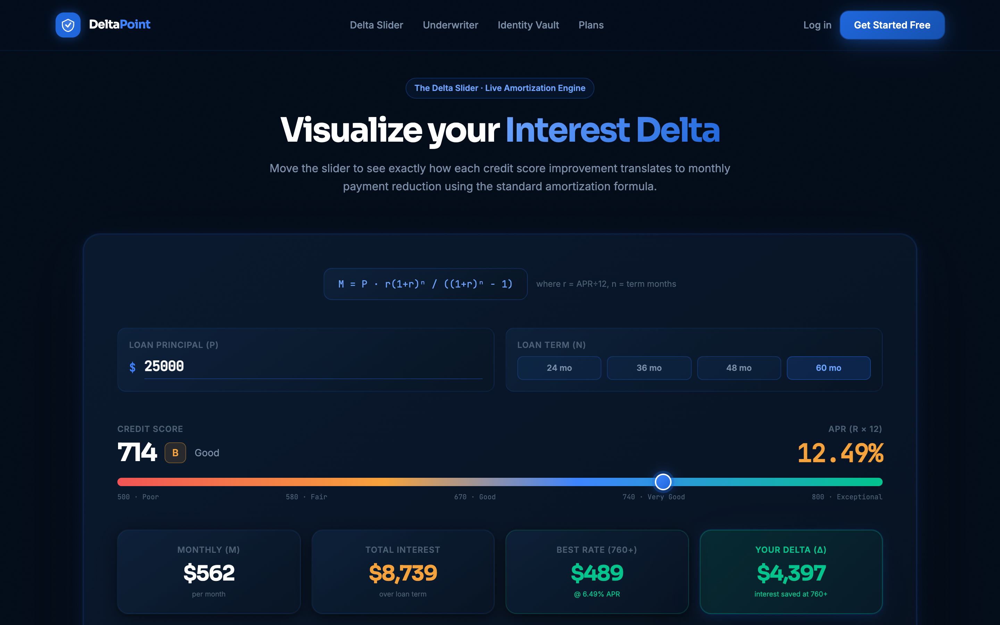
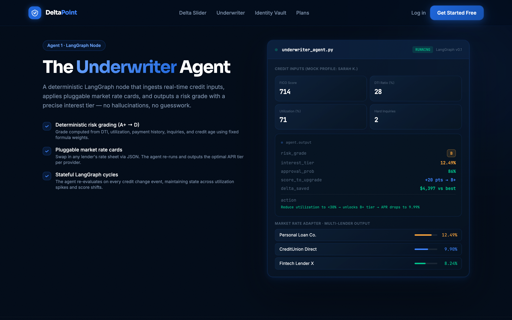
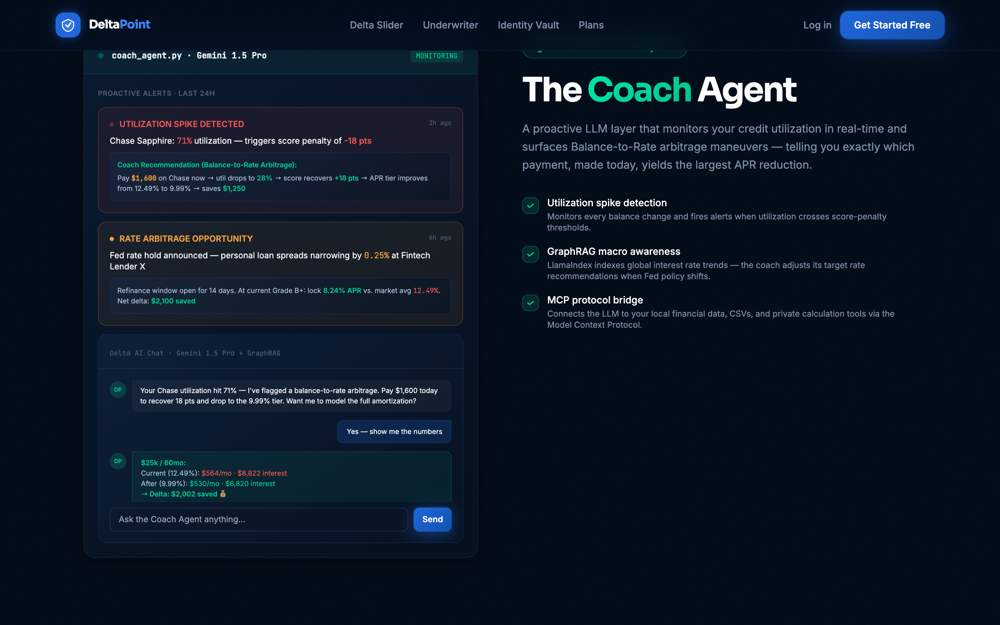
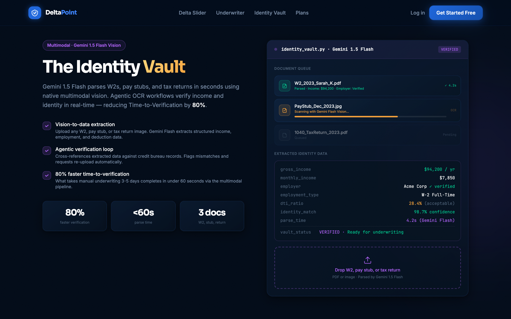
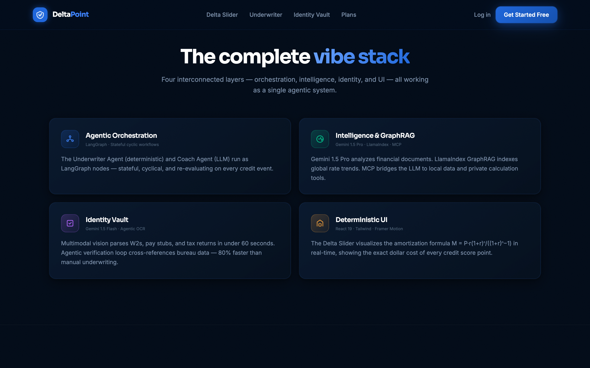
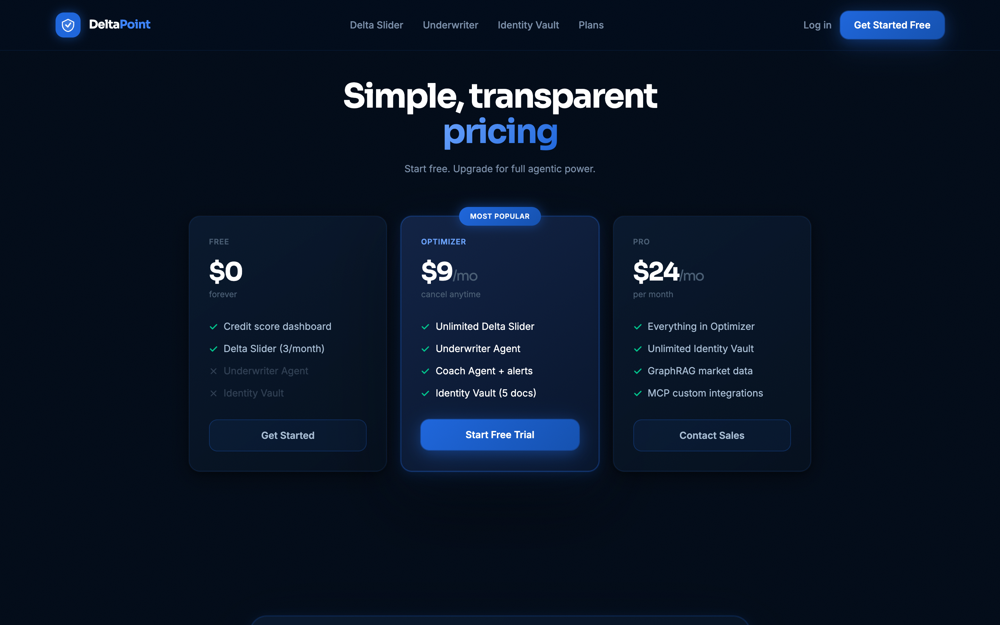

# DeltaPoint — The Agentic Credit-to-Yield Engine

> A deterministic financial co-pilot that bridges the gap between **credit health** and **cost of capital**. DeltaPoint maps real-time credit data against a universal Market Rate adapter, identifies your exact **Interest Delta**, and provides an agentic roadmap to unlock lower APRs across any lender.


---

## Table of Contents

- [Overview](#overview)
- [Live Demo](#live-demo)
- [Screenshots](#screenshots)
- [Architecture](#architecture)
- [Tech Stack](#tech-stack)
- [Features](#features)
- [Getting Started](#getting-started)
- [Project Structure](#project-structure)
- [The Delta Formula](#the-delta-formula)
- [Agent System](#agent-system)
- [License](#license)

---

## Overview

DeltaPoint answers one question: **"What is the exact dollar cost of your current credit score — and what's the fastest path to a lower rate?"**

It does this through four interconnected layers:

| Layer | What it does |
|---|---|
| **Underwriter Agent** | Deterministic LangGraph node that calculates risk grades (A+ → D) and interest tiers from live credit inputs |
| **Coach Agent** | Proactive LLM layer (Gemini 1.5 Pro) that monitors utilization spikes and surfaces Balance-to-Rate arbitrage moves |
| **Identity Vault** | Gemini 1.5 Flash multimodal vision that parses W2s, pay stubs, and tax returns in under 60 seconds |
| **Delta Slider** | Interactive amortization UI that visualizes the exact dollar value of every credit score point |

---

## Live Demo

```bash
git clone https://github.com/bnamatherdhala7/DeltaPoint-Underwriter.git
cd DeltaPoint-Underwriter
npm install
node serve.mjs
# → Open http://localhost:3000
```

---

## Screenshots

### Hero — The Agentic Credit-to-Yield Engine


> The hero communicates the core value prop: **Interest Delta** — the exact dollar difference between your current APR and the best available rate. Live market ticker shows real-time Fed rate, SOFR, Prime Rate, and personal loan averages.

---

### Delta Slider — Live Amortization Calculator


> Drag the credit score slider (500–800) to see monthly payments, total interest, and your **Interest Delta** recalculate in real-time using the standard amortization formula. Adjust loan principal and term. Full 10-tier APR table shows every score band.

---

### Underwriter Agent — LangGraph Deterministic Node


> Edit credit inputs (FICO score, DTI ratio, utilization %, hard inquiries) and watch the Underwriter Agent output update live: risk grade, interest tier, approval probability, and the exact action needed to upgrade. Multi-lender Market Rate Adapter shows side-by-side APR comparison across providers.

---

### Coach Agent — Proactive Arbitrage Alerts


> The Coach Agent monitors credit utilization in real-time and fires proactive alerts when thresholds are crossed. Each alert includes a specific Balance-to-Rate arbitrage recommendation with dollar amounts. Live chat powered by Gemini 1.5 Pro with GraphRAG macro rate context.

---

### Identity Vault — Gemini 1.5 Flash OCR


> Upload W2s, pay stubs, or tax returns. Gemini 1.5 Flash parses them in under 60 seconds and outputs structured data: gross income, employer verification, employment type, DTI ratio, and identity confidence score. 80% faster than manual underwriting.

---

### Features — The Complete Vibe Stack


> Overview of all four system layers: Agentic Orchestration (LangGraph), Intelligence & GraphRAG (Gemini + LlamaIndex + MCP), Identity Vault (Gemini Flash), and Deterministic UI (React 19 + Framer Motion).

---

### Pricing


---

## Architecture

```
┌─────────────────────────────────────────────────────────┐
│                     USER CREDIT PROFILE                  │
│         (Score · DTI · Utilization · Inquiries)          │
└────────────────────────┬────────────────────────────────┘
                         │
              ┌──────────▼──────────┐
              │   LANGGRAPH STATE   │  ← Stateful cyclic graph
              │   MACHINE (MCP)     │  ← Model Context Protocol
              └──────────┬──────────┘
                         │
          ┌──────────────┼──────────────┐
          │                             │
┌─────────▼──────────┐     ┌───────────▼───────────┐
│  UNDERWRITER AGENT  │     │     COACH AGENT        │
│  (Deterministic)    │     │  (Gemini 1.5 Pro LLM)  │
│                     │     │                        │
│  • Risk Grade A+→D  │     │  • Util spike alerts   │
│  • Interest Tier    │     │  • Balance-to-Rate arb  │
│  • Approval Odds    │     │  • GraphRAG macro data  │
│  • Market Rate Card │     │  • LlamaIndex RAG       │
└─────────┬──────────┘     └───────────┬────────────┘
          │                             │
          └──────────────┬──────────────┘
                         │
              ┌──────────▼──────────┐
              │   IDENTITY VAULT    │
              │  Gemini 1.5 Flash   │
              │                     │
              │  • W2 / Pay Stub    │
              │  • Tax Return OCR   │
              │  • Income Verified  │
              │  • 80% faster TTV   │
              └──────────┬──────────┘
                         │
              ┌──────────▼──────────┐
              │   DELTA SLIDER UI   │
              │  React 19 · Tailwind │
              │  Framer Motion      │
              │                     │
              │  M = P·r(1+r)ⁿ      │
              │      ─────────      │
              │      (1+r)ⁿ−1       │
              └─────────────────────┘
```

---

## Tech Stack

### 1. Agentic Orchestration
| Tool | Role |
|---|---|
| [LangGraph](https://github.com/langchain-ai/langgraph) | Stateful, cyclic multi-agent workflow orchestration |
| [Model Context Protocol (MCP)](https://modelcontextprotocol.io) | Bridge between LLM and local financial data, CSVs, private tools |
| [Claude Code](https://claude.ai/code) | Development environment — terminal-based agentic iteration |

### 2. Intelligence & RAG
| Tool | Role |
|---|---|
| [Gemini 1.5 Pro](https://aistudio.google.com) | Long-context analysis of financial documents and market filings |
| [LlamaIndex GraphRAG](https://www.llamaindex.ai) | Indexes global interest rate trends and macroeconomic shifts |
| Market Rate Adapter | Pluggable JSON rate cards — swap any lender's APR sheet |

### 3. Identity Vault
| Tool | Role |
|---|---|
| [Gemini 1.5 Flash](https://aistudio.google.com) | High-speed multimodal vision for W2, pay stub, tax return parsing |
| Agentic OCR Pipeline | Cross-references extracted data against credit bureau records |

### 4. Deterministic UI
| Tool | Role |
|---|---|
| React 19 | Component framework |
| Tailwind CSS | Utility-first styling |
| Framer Motion | Spring-physics animations |
| Delta Slider | Custom amortization visualization component |

---

## Features

### Delta Slider
- **Loan inputs:** Principal ($5k–$100k) and term (24 / 36 / 48 / 60 months)
- **Score range:** 500–800 with 10 APR tiers (D → A+)
- **Live outputs:** Monthly payment (M), total interest, best available rate, and your **Interest Delta**
- **Tier table:** Full score-to-APR breakdown with delta vs. worst-case baseline

### Underwriter Agent
- **Inputs:** FICO score, DTI ratio, credit utilization, hard inquiries
- **Outputs:** Risk grade, APR tier, approval probability, score-to-upgrade distance, specific action
- **Market Rate Adapter:** Multi-lender comparison (Personal Loan Co., CreditUnion Direct, Fintech Lender X)
- **Penalties:** DTI > 43%, utilization > 75%, inquiries > 4 each trigger grade downgrades

### Coach Agent
- **Monitoring:** Real-time utilization spike detection with score-penalty calculation
- **Arbitrage:** Balance-to-Rate recommendations with exact dollar amounts
- **Chat:** Conversational interface with Gemini 1.5 Pro + GraphRAG market context
- **Macro awareness:** Fed rate decisions, spread changes, refinance windows

### Identity Vault
- **Documents:** W2, pay stubs, tax returns (PDF or image)
- **Extraction:** Gross income, monthly income, employer, employment type, DTI, identity confidence
- **Speed:** Under 60 seconds vs. 3–5 days manual underwriting
- **Verification:** Cross-references extracted data against credit bureau records

---

## Getting Started

### Prerequisites
- Node.js 18+
- npm

### Installation

```bash
# 1. Clone the repository
git clone https://github.com/bnamatherdhala7/DeltaPoint-Underwriter.git
cd DeltaPoint-Underwriter

# 2. Install dependencies
npm install

# 3. Start the local server
node serve.mjs
# → Server running at http://localhost:3000

# 4. Open in browser
open http://localhost:3000
```

### Taking Screenshots

```bash
# Screenshot the full page
node screenshot.mjs http://localhost:3000

# Screenshot with a label
node screenshot.mjs http://localhost:3000 hero

# Screenshots are saved to ./temporary screenshots/screenshot-N-label.png
```

---

## Project Structure

```
DeltaPoint-Underwriter/
│
├── index.html                  # Full single-page app (Tailwind CDN)
│   ├── Hero section            # Value prop + phone mockups + market ticker
│   ├── Delta Slider            # Live amortization calculator (JS)
│   ├── Underwriter Agent       # Deterministic risk grading panel
│   ├── Coach Agent             # Proactive alerts + live chat
│   ├── Identity Vault          # OCR mock + extracted data panel
│   ├── Features overview       # 4-module vibe stack summary
│   └── Pricing                 # Free / Optimizer / Pro tiers
│
├── serve.mjs                   # Node.js local dev server (port 3000)
├── screenshot.mjs              # Puppeteer screenshot utility
│
├── docs/
│   └── screenshots/            # Section screenshots for documentation
│       ├── 00-full-page.png
│       ├── 01-hero.png
│       ├── 02-delta-slider.png
│       ├── 03-underwriter.png
│       ├── 04-coach-agent.png
│       ├── 05-identity-vault.png
│       ├── 06-features.png
│       └── 07-pricing.png
│
├── brand_assets/               # Design reference images
├── package.json
└── README.md
```

---

## The Delta Formula

The core of DeltaPoint is the standard loan amortization formula:

$$M = P \frac{r(1+r)^n}{(1+r)^n - 1}$$

Where:
- `M` = Monthly payment
- `P` = Principal loan amount
- `r` = Monthly interest rate (`APR ÷ 12 ÷ 100`)
- `n` = Number of monthly payments (loan term)

**Interest Delta** = Total interest at current APR − Total interest at target APR

```
Δ = (M_current × n − P) − (M_target × n − P)
  = (M_current − M_target) × n
```

**Example** ($25,000 / 60 months):

| Score | Grade | APR | Monthly | Total Interest | Delta vs. D |
|---|---|---|---|---|---|
| 300–579 | D | 24.99% | $734 | $19,040 | — |
| 620–659 | C | 18.99% | $648 | $13,880 | +$5,160 |
| 700–719 | B | 12.49% | $562 | $8,739 | +$10,301 |
| 740–759 | A− | 8.24% | $510 | $5,600 | +$13,440 |
| 780–850 | A+ | 6.49% | $489 | $4,340 | +$14,700 |

---

## Agent System

### Underwriter Agent (Deterministic)

```python
# Pseudocode — LangGraph node
def underwriter_node(state: CreditState) -> AgentOutput:
    tier = get_apr_tier(state.fico_score)
    
    # Apply penalty rules
    if state.dti > 43: tier = downgrade(tier, 2)
    elif state.dti > 36: tier = downgrade(tier, 1)
    if state.utilization > 75: tier = downgrade(tier, 1)
    if state.inquiries > 4: tier = downgrade(tier, 1)
    
    return AgentOutput(
        risk_grade=tier.grade,
        interest_tier=tier.apr,
        approval_prob=tier.base_prob,
        action=generate_action(tier, state),
        delta=calculate_delta(tier.apr, BEST_APR, state.principal)
    )
```

### Coach Agent (LLM + GraphRAG)

```python
# Pseudocode — Gemini 1.5 Pro + LlamaIndex
def coach_node(state: CreditState) -> CoachAlert:
    # Monitor utilization
    if state.utilization > 70:
        arbitrage = calculate_balance_to_rate_move(state)
        return CoachAlert(
            type="UTILIZATION_SPIKE",
            action=arbitrage.recommended_payment,
            score_impact=arbitrage.projected_score_gain,
            delta=arbitrage.interest_savings
        )
    
    # Check macro context via GraphRAG
    macro = query_graphrag("current Fed rate spreads personal loans")
    if macro.spread_narrowing:
        return CoachAlert(type="RATE_ARBITRAGE", window=macro.opportunity)
```

### Identity Vault (Gemini 1.5 Flash)

```python
# Pseudocode — Multimodal vision pipeline
def parse_document(file: UploadedFile) -> VerifiedIdentity:
    response = gemini_flash.generate(
        prompt="Extract: gross_income, employer, employment_type, dti from this document",
        image=file
    )
    extracted = parse_structured(response)
    
    # Agentic verification loop
    bureau_match = cross_reference_bureau(extracted)
    if bureau_match.confidence < 0.90:
        return request_reupload(extracted, bureau_match.mismatch)
    
    return VerifiedIdentity(**extracted, confidence=bureau_match.confidence)
```

---

## License

MIT © 2026 DeltaPoint Inc.

---

*Built with [Claude Code](https://claude.ai/code) · Powered by Gemini 1.5 Pro · Orchestrated by LangGraph*
